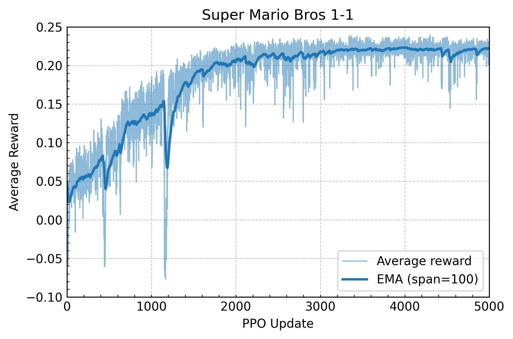
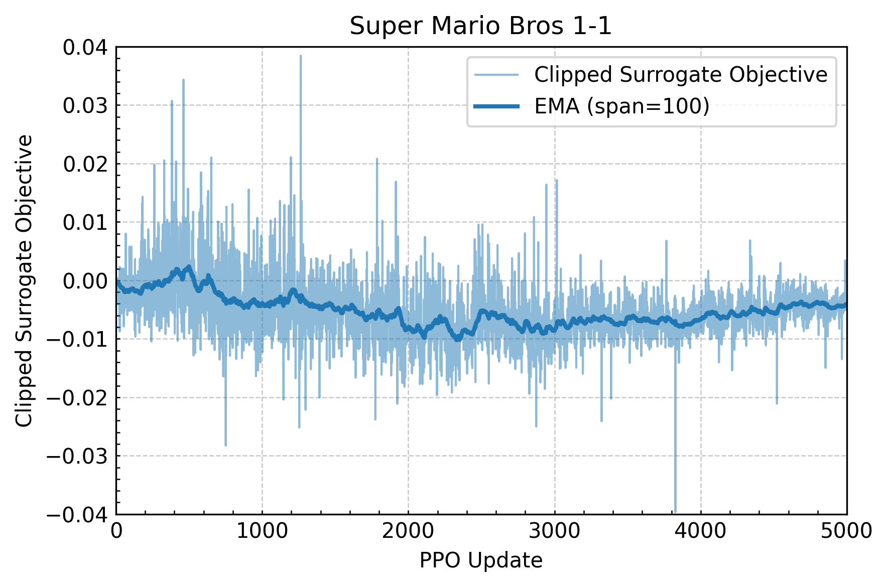
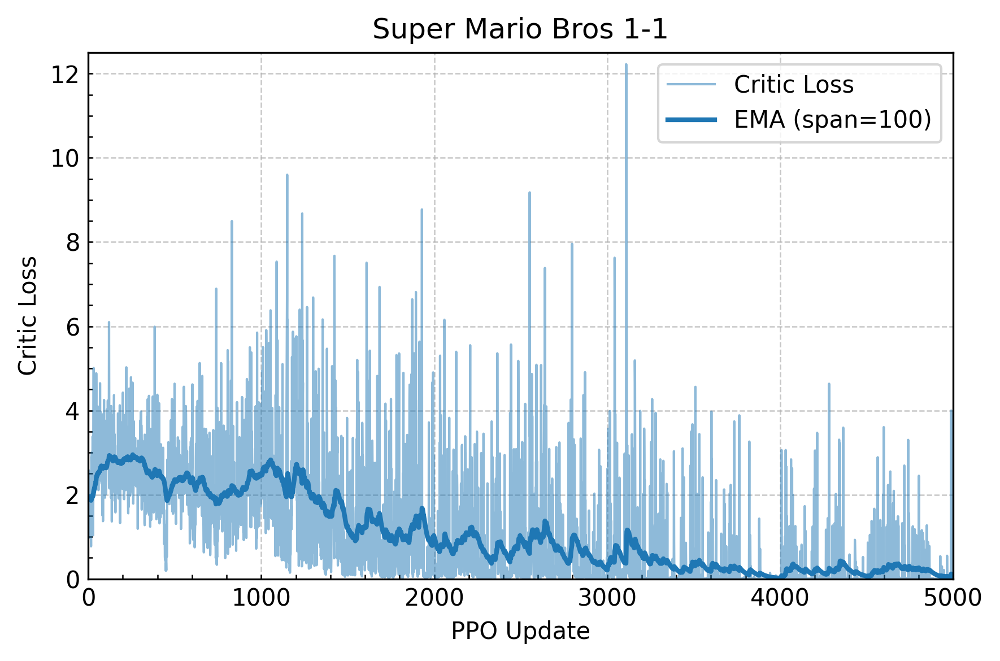

# Proximal Policy Optimization on Super Mario Bros

This repository provides an implementation of **Proximal Policy Optimization (PPO)** applied to the classic *Super Mario Bros* environments.
It enables training and evaluating reinforcement learning agents that learn to play Mario using PyTorch.

<video src="assets/play1-1.mp4" width="256" height="240" controls></video>

📖 For a brief introduction to PPO, see [docs/PPO.md](./docs/PPO.md).

---

## Getting Started

### Step 1. Set up the environment

We recommend creating a virtual environment (e.g., `venv`):

```bash
python -m venv myenv
source myenv/bin/activate
pip install -r requirements.txt
```

If you plan to use CUDA for acceleration, make sure to install the appropriate PyTorch build for your GPU and CUDA toolkit.

---

### Step 2. Train on Stage 1-1

To train an agent on *Stage 1-1*:

```bash
python train.py --name test1-1 --world 1 --stage 1 --device cuda:0 --version 0 --frame_size 64
```

* The `--version` flag specifies the environment mode (see [gym-super-mario-bros](https://pypi.org/project/gym-super-mario-bros/) for details).
* Training logs are stored in TensorBoard. To monitor progress:

```bash
tensorboard --logdir ./experiments/test1-1/runs
```

---

### Step 3. Run Inference

After training, you can evaluate the trained agent:

```bash
python test.py --name test1-1 --ckpt best_model
```

This opens a display window so you can watch your agent play Mario in real time.

---

## Results (Stage 1-1)

We provide a trained checkpoint and TensorBoard logs for *Stage 1-1*.
The following metrics are visualized: average return, clipped surrogate objective, and critic loss.

</img> </img> </img>

The gameplay result from the trained agent is shown at the top of this README.
(He can clear Stage 1-1 faster than me!)

---